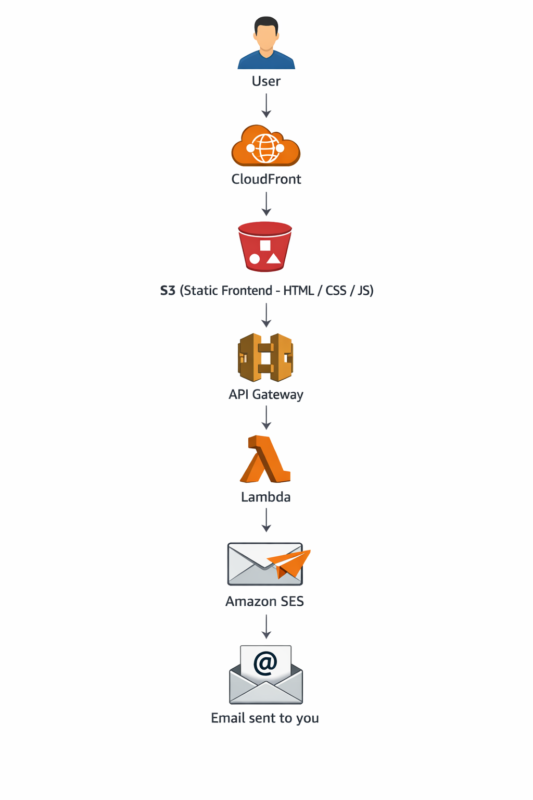

Fully serverless email reminder system built and deployed on AWS cloud.
# Serverless Cloud Reminder System

This project is a fully serverless reminder application built using AWS cloud services.  
It allows users to send reminder emails through a secure backend powered by AWS Lambda and Amazon SES.

🚀 Live Demo: https://d2y2l7cgdrvf5n.cloudfront.net

---

## Problem Statement

I wanted to understand how real-world serverless applications are designed, secured, and deployed in production-like environments.

This project simulates a simple reminder system where:

- A user enters an email and message
- The request is sent via API Gateway
- AWS Lambda processes the request
- Amazon SES delivers the email

---

## Architecture

User  
↓  
CloudFront (CDN)  
↓  
Amazon S3 (Static Frontend Hosting)  
↓  
API Gateway  
↓  
AWS Lambda  
↓  
Amazon SES  

---

## AWS Services Used

- AWS Lambda (Backend logic)
- API Gateway (HTTP endpoint)
- Amazon SES (Email delivery – sandbox mode)
- Amazon S3 (Static hosting)
- CloudFront (CDN distribution)
- IAM (Role-based permissions & security policies)

---

## Key Learning Outcomes

- Designed a fully serverless architecture
- Configured IAM roles and permissions securely
- Implemented CORS policies between frontend and backend
- Understood SES sandbox limitations and email verification
- Deployed static frontend with global CDN distribution
- Structured project with version control using GitHub

---

## Live Demo

Frontend (CloudFront):
https://d2y2l7cgdrvf5n.cloudfront.net

---

## Future Improvements

- Move SES out of sandbox to allow public email sending
- Add DynamoDB logging for reminders
- Implement Infrastructure as Code using Terraform or CloudFormation
---

## Screenshots

## Architecture Overview

This project follows a fully serverless architecture:

- Frontend hosted on Amazon S3
- Distributed globally using CloudFront
- API handled by API Gateway
- Backend logic executed via AWS Lambda
- Emails sent using Amazon SES (Sandbox mode)

### Why Serverless?

This project was designed using a serverless approach to:
- Eliminate server management
- Achieve automatic scaling
- Reduce infrastructure costs
- Improve availability and fault tolerance
- Follow modern cloud-native best practices
  
## Tech Stack

- Amazon S3
- Amazon CloudFront
- Amazon API Gateway
- AWS Lambda (Python)
- Amazon SES
- HTML / CSS / JavaScript

## Security Considerations

- IAM role-based permissions for Lambda execution
- SES configured in sandbox mode with verified identities
- CORS enabled for secure frontend-to-API communication

## Architecture Diagram

  

